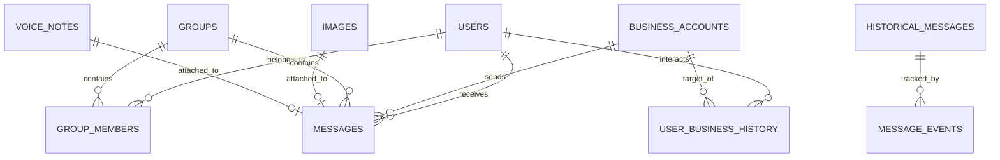

# Dataset Analysis & Entity Relationship Report

## 1. Overview

The **WhatsApp Notification Router** dataset comprises 13 interconnected CSV files and a directory of media assets (`dataset/media/`).

---

## 2. Inferred Schemas & Fields

### Core Input Files
- **`messages.csv`** (110 rows): Incoming messages to route.
  - `message_id`: Unique identifier (e.g. `msg_023`).
  - `user_id`: Receiving user ID.
  - `conversation_type`: `personal`, `group`, or `business`.
  - `group_id` / `business_id` / `sender_user_id`: Optional foreign keys.
  - `message_text`: Main text content (empty for voice notes).
  - `media_type`: `image`, `voice`, or empty.
  - `media_id`: Foreign key to `images.csv` or `voice_notes.csv`.
  - `forwarded_count`: Counter indicating how many times message was forwarded.

- **`sample_messages.csv`** (30 rows): Ground truth solved benchmark messages. Includes `action`, `message_type`, `reason`, `confidence`, and `evidence_message_ids`.

### User & Behavioral Files
- **`users.csv`** (54 users):
  - `user_id`, `do_not_disturb_window` (e.g. `22:00-07:00`), `messages_opened_30d`, `messages_replied_30d`, `notifications_dismissed_30d`, `messages_reported_30d`.
- **`groups.csv`** (23 groups):
  - `group_id`, `group_name`, `group_type` (`society`, `school_group`, `family`, `coworker`, `marketplace`, etc.), `member_count`, `admin_count`.
- **`group_members.csv`** (402 relationships):
  - `group_id`, `user_id`, `role` (`admin`/`member`), `messages_sent_30d`, `group_muted_by_user` (boolean `0` or `1`).
- **`business_accounts.csv`** (110 businesses):
  - `business_id`, `display_name`, `brand_name`, `category`, `verified` (`0`/`1`), `official_domain`, `domain_used_by_sender`, `user_reports_30d`.
- **`user_business_history.csv`** (107 records):
  - `user_id`, `business_id`, `why_user_knows_account`, `allows_promotions`, `promotions_opted_out_at`.

---

## 3. Entity Relationship (ER) Diagram

---

## 4. Derived Insights & Safety Rules

1. **Domain Spoofing Risk**: Unverified business senders using domains different from their official brand domain (e.g., claimed `chase.com` but sent from `chase-secure-alert.com`) represent high phishing risks and must be muted.
2. **Heavy Dismissal Behavior**: Users with high dismissal counts (`notifications_dismissed_30d > 50`) will automatically mute non-urgent promotional broadcasts.
3. **Muted Groups & Direct Tags**: If a user has muted a group (`group_muted_by_user = 1`), routine messages are suppressed. However, if the user is directly tagged (`@u_user_id`) or an admin sends an urgent notice, the router elevates priority to `notify`.
