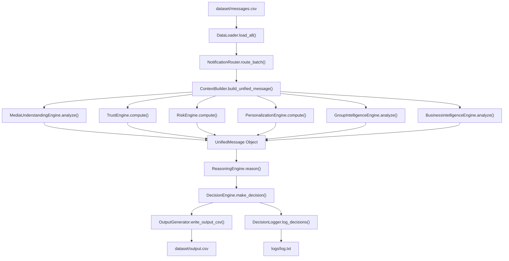

# Repository Analysis & Architecture Report

## 1. Executive Overview

This document provides a comprehensive reverse-engineering analysis of the **HackerRank Orchestrate — WhatsApp Notification Router** codebase and dataset infrastructure.

The system is designed to transform an unorganized stream of WhatsApp messages—including text messages, image posters/screenshots, and voice notes—into a personalized, high-precision notification routing decisions (`notify`, `digest`, or `mute`).

---

## 2. Directory & Component Structure

```text
hackerrank-orchestrate-august26/
├── AGENTS.md                          # Challenge rules & conversation logging instructions
├── problem_statement.md               # Challenge specifications & allowable schemas
├── README.md                          # Primary setup & architecture document
├── dataset/                           # Ground-truth datasets & media files
│   ├── messages.csv                   # Input messages requiring predictions (110 rows)
│   ├── sample_messages.csv            # Solved benchmark examples (30 rows)
│   ├── output.csv                     # Final submission template
│   ├── users.csv                      # User notification behavior & DND settings
│   ├── groups.csv                     # Group metadata
│   ├── group_members.csv              # User-group membership & engagement
│   ├── business_accounts.csv          # Business sender metadata & domain verification
│   ├── user_business_history.csv      # User-business activity & opt-out records
│   ├── message_history.csv            # Historical messages for evidence lookup
│   ├── message_events.csv             # Past user reactions (opened/replied/dismissed)
│   ├── images.csv                     # Image ID to path mapping (20 images)
│   ├── voice_notes.csv                # Voice note ID to path mapping (13 audio files)
│   ├── daily_notification_summary.csv # User daily notification loads
│   └── media/                         # JPG images and MP3 audio files
├── code/                              # Core implementation package
│   ├── main.py                        # Primary CLI entry point
│   ├── output_generator.py            # CSV output writer & schema validator
│   ├── logger.py                      # Explainable decision trace logger
│   ├── config/
│   │   └── settings.py                # Centralized threshold & API configuration
│   ├── data/
│   │   ├── models.py                  # Dataclasses & Enums (Message, User, TrustScore, etc.)
│   │   └── data_loader.py             # High-performance CSV parser & indexer
│   ├── pipeline/
│   │   ├── media_understanding.py     # Multimodal OCR & audio transcription
│   │   ├── trust_engine.py            # Sender trust score calculator (0-100)
│   │   ├── risk_engine.py             # Scam, phishing & prompt injection detector
│   │   ├── personalization.py         # User interest & engagement score
│   │   ├── group_intelligence.py      # Direct mentions & admin announcement analysis
│   │   ├── business_intelligence.py   # Domain verification & transactional classifier
│   │   ├── context_builder.py         # Normalizes unified message context
│   │   ├── reasoning_engine.py        # Gemini LLM & fallback reasoning engine
│   │   ├── decision_engine.py         # Hybrid rule & safety override engine
│   │   └── notification_router.py     # Pipeline orchestrator
│   ├── evaluation/
│   │   ├── main.py                    # Benchmark evaluator against sample messages
│   │   └── report.md                  # Generated evaluation report
│   └── tests/                         # Pytest unit tests
└── docs/                              # Architecture & analysis documentation
```

---

## 3. Data Execution Pipeline & Call Graph



---

## 4. Reusable Modules & Modular Extensibility

1. **DataLoader (`code/data/data_loader.py`)**: Pre-indexes all 13 CSV files into standard Python dictionaries and dataclasses for O(1) context lookups.
2. **ContextBuilder (`code/pipeline/context_builder.py`)**: Assembles all relevant historical evidence, sender metrics, group roles, and user DND windows into a single `UnifiedMessage` dataclass.
3. **Multimodal Media Understanding (`code/pipeline/media_understanding.py`)**: Handles visual OCR for posters and screenshots via Groq Vision (`llama-3.2-11b-vision-preview`), and audio transcription for voice notes via Groq Audio (`whisper-large-v3`).
4. **Safety & Risk Engine (`code/pipeline/risk_engine.py`)**: Operates independently of user preferences. Guarantees that OTP phishing, fake support threats, domain spoofing, and prompt injection attacks are automatically suppressed with `action=mute`.
5. **Evaluation Benchmark (`code/evaluation/main.py`)**: Computes precision, recall, F1, and confusion matrices against solved sample benchmark rows.
